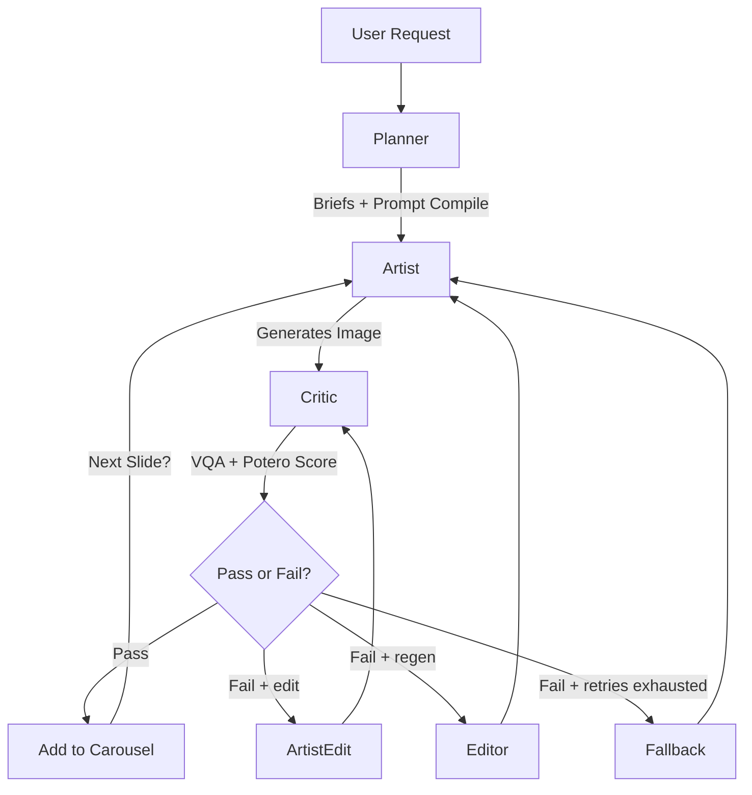

This consolidates the architectural sophistication of the **Cyclic Refinement Swarm** (File 1) with the strict operational constraints and domain specificity of the **Potero Carousel Factory** (File 2).

This version optimizes for the "Reasoning-First" capabilities of Gemini 3 Pro while maintaining the ruthlessly specific OPSEC and aesthetic guidelines of Potero.

---

# AGENTS.md — Potero Carousel Factory (Cyclic Swarm Edition)

**Version:** 2.0 (Gemini 3 Pro Swarm)
**Status:** Production
**Architecture:** Cyclic Refinement Graph

## 1. System Philosophy

This system generates 5-slide, 4:5 vertical image carousels for Potero using a **Multi-Agent Cyclic Graph** (Swarm Pattern). Unlike linear pipelines that propagate errors, this architecture uses an adversarial critique loop ("The Critic") to reject and refine outputs *before* they are accepted into the carousel.

### Core Principles

1. **Adversarial Quality Assurance:** The system assumes the generator will hallucinate (e.g., faces, text, wrong kit). The **Critic Agent** exists solely to reject these errors.
2. **Context Anchoring:** Slide 1 serves as the "Anchor." Slides 2–5 inject Slide 1 into their context window to enforce "same shoot day" consistency.
3. **OPSEC & Brand Integrity:**
* **No Faces:** Anonymity is absolute.
* **No In-Image Text:** Captions are post-production only, except the approved "POTERO STANDARD" embroidery that must exactly match the hoodie reference (size, color, placement) when the hoodie front is visible. Back shots may omit it.
* **Grey Man Realism:** Solid Ranger Green/Grey kit silhouettes only; no camouflage patterns.


4. **Reasoning-First Generation:** We leverage **Gemini 3 Pro's** reasoning capabilities to "plan" the composition (lighting, negative space) before rendering pixels.

---

## 2. Orchestration Workflow (State Machine)

The agents operate within a LangGraph state machine.



---

## 3. Agent Personas

### Agent A: The Planner (Strategy & Assets)

* **Role:** Pre-production logic. Converts a theme into a concrete execution plan.
* **Model:** `gemini-1.5-pro` (Text)
* **Responsibilities:**
* **Theme Parsing:** Converts `theme_id` (e.g., "winter_ambush") into 5 distinct `SlideBriefs`.
* **Asset Locking:** Selects one `design_id` (Hoodie) and locks it for the entire carousel.
* **Prompt Compilation:** Injects locked Potero shader and negative blocks and compiles deterministic prompts.
* **Reference Roles:** Infers role requirements (ENV/gear) and attaches role-based packs via registry + golden packs.
* **Metadata:** Populates intent, env preset, lighting signature, risk profile, kit anchors, and image size/aspect.


* **Output:** `CarouselState` object containing 5 initialized briefs.

### Agent B: The Artist (Generative Synthesis)

* **Role:** The "Hand." Executes the visual generation.
* **Model:** `gemini-3-pro-image-preview` (Nano Banana Pro)
* **System Instruction:**
> "You are a world-class photographer specializing in Finnish military realism. You follow the Slide Brief exactly. You use the provided Reference Images as strict ground truth. You do not hallucinate new details. **CRITICAL:** You never render text, logos, or faces. You prioritize grit, high ISO grain, and 'crushed blacks' aesthetics."
> "Exception: the only allowed text/logo is the approved hoodie embroidery that must match the reference images exactly."


* **Capabilities:**
* **Reasoning-Guided Synthesis:** Plans composition to ensure negative space exists for overlay text (without rendering the text itself).
* **Anchor Injection:** For Slides 2–5, ingests the image of Slide 1 to match lighting and color grading.
* **Candidate Pool:** Slide 1 can generate multiple candidates and select the best by critic score.
* **Edit Path:** Localized fixes use ArtistEdit rather than full regeneration.


### Agent C: The Critic (Adversarial VQA)

* **Role:** The "Eye." Validates the output against strict Potero constraints.
* **Model:** `gemini-1.5-pro` (Vision Mode)
* **Methodology:** Visual Question Answering (VQA).
* **Checklist (The "Kill List"):**
1. **OPSEC Breach:** "Is a face or identifiable tattoo visible?" (If Yes -> **HARD FAIL**)
2. **Brand Violation:** "Is there readable text, a logo, or a flag?" (If Yes -> **HARD FAIL**)
   - Exception: the approved "POTERO STANDARD" embroidery is allowed only if it matches the hoodie reference exactly when the front is visible. Back shots may omit it.
3. **Anatomy:** "Zoom in on hands. Are there exactly 5 fingers? Are they holding the gear correctly?"
4. **Kit Accuracy:** "Is the gear solid Ranger Green/Grey with no camouflage patterns?"
5. **Aesthetics:** "Is the lighting flat or glossy? We need harsh shadows and flash photography. If it looks like Midjourney artstation style, reject."


* **Output:** `QAResult` with OPSEC pass, Potero score breakdown, repair targets, and confidence.

### Agent D: The Editor (Refinement & Recovery)

* **Role:** The "Fixer." Activated only upon Critic rejection or Potero drift.
* **Model:** `gemini-2.5-flash` (Logic/Speed optimized)
* **Workflow:**
1. Analyzes the Critic's failure reason (e.g., "Lighting is too flat").
2. Modifies the prompt *specifically* to address the flaw without changing the composition (e.g., appends "harsh camera flash, high contrast, underexposed").
3. Requests a seed change if the anatomy is broken.
4. Applies style-tighten deltas when Potero score is below target but OPSEC passes.


---

## 4. Data Structures & State

### Shared State Object

```json
{
  "carousel_id": "run_2026_01_12_alpha",
  "global_constraints": {
    "design_id_locked": "hoodie_013_ranger_green",
    "environment": "pine_forest_fog",
    "aspect_ratio": "4:5",
    "potero_shader_version": "v1_1",
    "image_aspect": "4:5",
    "image_size": "2K",
    "allow_warn_pass": false,
    "potero_pass_threshold": 7.5,
    "potero_warn_threshold": 6.0,
    "enable_edit_mode": true,
    "max_refs_per_call": 10,
    "max_refs_hard": 14,
    "anchor_candidates": 3
  },
  "slides": [
    {
      "index": 1,
      "status": "completed",
      "image_path": "out/slide1.png",
      "qa_score": 98,
      "opsec_pass": true,
      "potero_score": 8.4
    },
    {
      "index": 2,
      "status": "in_progress",
      "retry_count": 1,
      "last_critic_feedback": "FAIL: Camo pattern detected. Enforce solid gear."
    }
  ]
}

```

### Slide Brief (Input to Artist)

```json
{
  "shot_type": "close_up_texture",
  "positive_prompt": "Macro shot of hoodie fabric, water droplets beading, pine needle foreground...",
  "negative_prompt": "text, watermark, face, eyes, illustration, cartoon, bright sunlight",
  "reference_assets": [
    "path/to/solid_fabric_reference.png",
    "path/to/hoodie_013_macro.png",
    "path/to/slide_1_anchor.png" 
  ],
  "composition_guidance": "Leave top-left quadrant empty (negative space) for post-production typography.",
  "intent": "artifact_detail",
  "continuum_cue": "coffee ritual",
  "kit_anchors": ["GREY_MAN_GEAR"],
  "env_preset": "taiga_winter_kaamos",
  "lighting_signature": "lofi_flash_on_axis_kaamos",
  "risk_profile": "low",
  "reference_roles_required": ["ENV_TAIGA_WINTER_KAAMOS", "DESIGN_FRONT"],
  "image_aspect": "4:5",
  "image_size": "2K"
}

```

---

## 5. Resilience & Fallback Hierarchy

To ensure production reliability, the system employs a "Graceful Degradation" strategy.

### Model Fallback

If `gemini-3-pro-image-preview` hits a 503 or Rate Limit:

1. **Primary:** `gemini-3-pro-image-preview` (Best reasoning/fidelity).
2. **Secondary:** `imagen-3.0-generate-001` (High throughput, reliable, strictly guided).
3. **Tertiary:** `gemini-1.5-flash` (Lowest fidelity—use only for "far away" silhouettes).

### Content Fallback (Potero-safe templates)

If retries are exhausted:

* The system switches to a Potero-safe fallback template (edge-of-human, gear layout, or environment-only).
* Fallbacks still include Potero shader/negative blocks and avoid high-risk content.

---

## 6. Prompt Invariants (Immutable Blocks)

**Locked Potero Shader** (loaded from `assets/potero/potero_shader_v1_1.txt`):
Prepended to every positive prompt by the planner.

**Locked Potero Negative** (loaded from `assets/potero/potero_negative_v1_1.txt`):
Prepended to every negative prompt by the planner.

---

## 7. Implementation Status

Implemented in this repo:
1. Versioned Potero shader/negative assets and planner invariants.
2. Role-based reference selection with golden packs and quality scoring.
3. Preflight drift checks and kit consistency compiler.
4. Critic v2 schema (OPSEC + Potero scoring + repair hints).
5. ArtistEdit path and edit-mode routing.
6. Potero-safe fallbacks and Slide 1 candidate pool.
7. Budget enforcement for candidate scoring.

---

## 8. Production Readiness Review (Current Gaps)

1. **Reference quality scoring depth:** Quality scoring uses file size and optional resolution; no watermark/sharpness scoring yet.
2. **Optional deps in CI:** Tests that require `langgraph` and `google-genai` are skipped if deps are missing.
3. **Config contract:** No `.env.example` is present; env var list is documented but not templated.

---

## 9. Required Inputs and Reference Locations

Place all "Gold" reference assets under `assets/references/` and keep a stable naming scheme. Suggested layout:

```
assets/references/
  manifest.json
  hoodies/
    hoodie_013_ranger_green_front.png
    hoodie_013_ranger_green_macro.png
```

Update `assets/references/manifest.json` to register assets with `path`, `role`, and optional `tags`. The planner infers role requirements and the reference selector chooses assets by role, optionally injecting golden packs.

Example manifest entry:
```
{
  "path": "hoodies/hoodie_013_ranger_green_front.png",
  "role": "DESIGN_FRONT",
  "tags": ["front", "hoodie"]
}
```

When `POTERO_REQUIRE_ASSETS=true`, the manifest must include:

- At least one asset for the selected `design_id`

Required env vars (names only):

- `GOOGLE_API_KEY`
- `POTERO_THEME_ID`
- `POTERO_DESIGN_ID`
- `POTERO_SHADER_VERSION`
- `POTERO_IMAGE_ASPECT`
- `POTERO_IMAGE_SIZE`
- `POTERO_ALLOW_WARN_PASS`
- `POTERO_POTERO_PASS_THRESHOLD`
- `POTERO_POTERO_WARN_THRESHOLD`
- `POTERO_ENABLE_EDIT_MODE`
- `POTERO_MAX_REFS_PER_CALL`
- `POTERO_MAX_REFS_HARD`
- `POTERO_ANCHOR_CANDIDATES`
- `POTERO_PLANNER_MODE` (`template` | `template+llm`)
- `POTERO_CRITIC_MODEL` (default `models/gemini-2.5-flash`)
- `POTERO_CRITIC_WARN_THRESHOLD` (default `85`)
- `POTERO_CRITIC_FAIL_THRESHOLD` (default `70`)
- `POTERO_PLANNER_MODEL` (default `models/gemini-2.5-flash`)
- `POTERO_ARTIST_MODEL` (default `models/gemini-2.5-flash-image`)
- `POTERO_ARTIST_FALLBACKS` (comma-separated models, defaults to image preview)
- `POTERO_EDITOR_MODEL`
- `POTERO_EDITOR_MODE`
- `POTERO_MAX_TOTAL_CALLS`
- `POTERO_MAX_PLANNER_CALLS`
- `POTERO_MAX_ARTIST_CALLS`
- `POTERO_MAX_CRITIC_CALLS`
- `POTERO_MAX_RETRIES_PER_SLIDE`

Budget limits are enforced per run; exceeding them stops generation.

Reference uploads are cached per run using file hash + role to avoid re-uploading the same files.

Critic outputs now include OPSEC pass, Potero score breakdown, violations, and repair targets.

You can also pass runtime inputs via CLI:

```
python -m src.main --theme winter_ambush --design hoodie_013_ranger_green
```

Outputs are written to `output/` by the Artist; keep this directory writable in production.

Run artifacts are stored per run under `output/<run_id>/`:

- `output/<run_id>/state.json`
- `output/<run_id>/briefs.json`

Testing and CI:

- Local tests: `python -m unittest discover -s tests`
- Smoke check: `POTERO_REQUIRE_API_KEY=false POTERO_REQUIRE_ASSETS=false python scripts/smoke_check.py`
- CI hook: `sh scripts/ci.sh` (used by `.github/workflows/ci.yml`)
- Install deps: `pip install -r requirements.txt`
- List available models: `python scripts/list_models.py`
