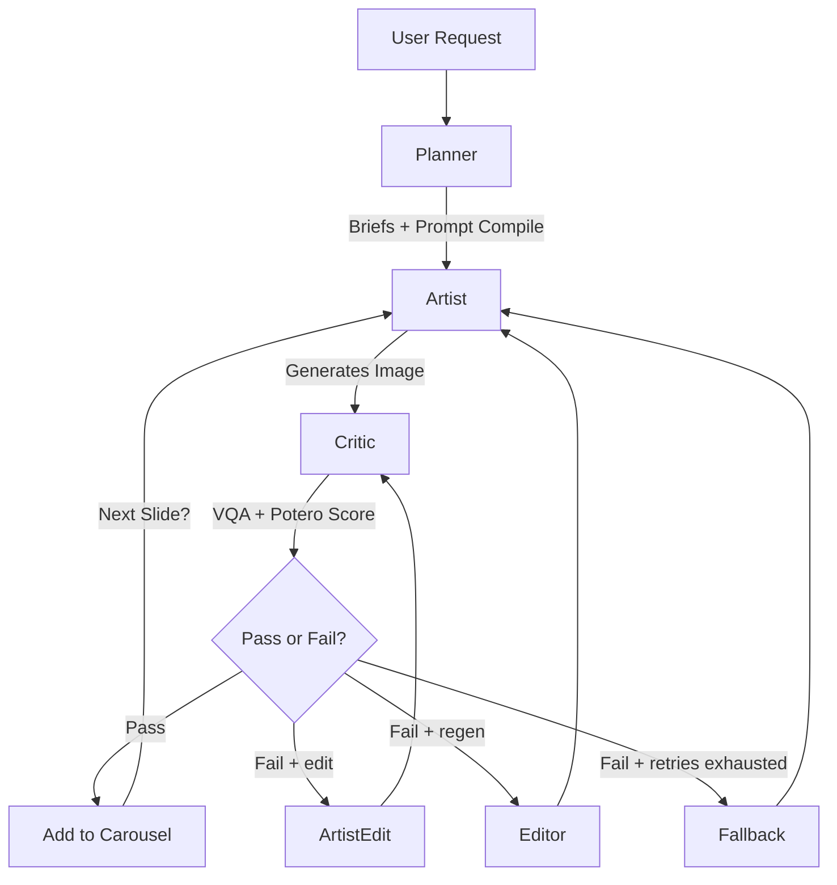

This consolidates the architectural sophistication of the **Cyclic Refinement Swarm** (File 1) with the strict operational constraints and domain specificity of the **Potero Carousel Factory** (File 2).

This version optimizes for the "Reasoning-First" capabilities of Gemini 3 Pro while maintaining the ruthlessly specific OPSEC and aesthetic guidelines of Potero.

---

# AGENTS.md — Potero Carousel Factory (Cyclic Swarm Edition)

**Version:** 2.1 (Gemini 3 Flash Swarm)
**Status:** Production
**Architecture:** Cyclic Refinement Graph (State Machine)

## 1. System Philosophy

This system generates 5-slide, 4:5 vertical image carousels for Potero using a **Multi-Agent Cyclic Graph** (Swarm Pattern). Unlike linear pipelines that propagate errors, this architecture uses an adversarial critique loop ("The Critic") to reject and refine outputs *before* they are accepted into the carousel.

### Core Principles

1. **Adversarial Quality Assurance:** The system assumes the generator will hallucinate (e.g., faces, text, wrong kit). The **Critic Agent** exists solely to reject these errors.
2. **Context Anchoring:** Slide 1 serves as the "Anchor." Slides 2–5 inject Slide 1 into their context window to enforce "same shoot day" consistency.
3. **OPSEC & Brand Integrity:**
* **No Faces:** Anonymity is absolute.
* **No In-Image Text:** Captions are post-production only, except the approved "POTERO STANDARD" embroidery that must exactly match the hoodie reference (size, color, placement) when the hoodie front is visible. Back shots may omit it.
* **Grey Man Realism:** Solid Ranger Green/Grey kit silhouettes only; no camouflage patterns.


4. **Reasoning-First Generation:** We leverage **Gemini 3 Flash's** reasoning capabilities to "plan" the composition (lighting, negative space) before rendering pixels.

---

## 2. Orchestration Workflow (State Machine)

The agents operate within a LangGraph state machine.



---

## 3. Agent Personas

### Agent A: The Planner (Strategy & Assets)

* **Role:** Pre-production logic. Converts a theme into a concrete execution plan.
* **Model:** `gemini-3-flash-preview` (Text/Logic)
* **Responsibilities:**
* **Theme Parsing:** Converts `theme_id` (e.g., "winter_ambush", "cqb_raid", "brutalist_shelter") into 5 distinct `SlideBriefs`.
* **Asset Locking:** Selects one `design_id` (Hoodie) and locks it for the entire carousel.
* **Prompt Compilation:** Injects locked Potero shader/negative v1.2 and compiles deterministic prompts.
* **Reference Roles:** Infers role requirements (ENV/gear) and attaches role-based packs via registry.
* **Metadata:** Populates intent, env preset, lighting signature, risk profile, kit anchors, and image size/aspect.


* **Output:** `CarouselState` object containing 5 initialized briefs.

### Agent B: The Artist (Generative Synthesis)

* **Role:** The "Hand." Executes the visual generation.
* **Model:** `gemini-3-pro-image-preview` (default, configurable)
* **Fallbacks:** Configurable fallback chain (e.g., `imagen-3.0-generate-001`, `gemini-1.5-flash`)
* **System Instruction:**
> "You are a world-class photographer specializing in Finnish military realism. You follow the Slide Brief exactly. You use the provided Reference Images as strict ground truth. You do not hallucinate new details. **CRITICAL:** You never render text, logos, or faces. You prioritize grit, high ISO grain, and 'crushed blacks' aesthetics."
> "Exception: the only allowed text/logo is the approved hoodie embroidery that must match the reference images exactly."


* **Capabilities:**
* **Interleaved Content:** Passes text prompts alongside reference images and the anchor in a single content array (semantic labeling per role).
* **Anchor Injection:** For Slides 2–5, ingests Slide 1 to match lighting and gear consistency.
* **Candidate Pool:** Slide 1 generates 3 candidates (budget-permitting); Critic scores each and selects the best.
* **Model Fallback:** If primary model fails (503, rate limit), tries fallback models in sequence.


### Agent C: The Critic (Adversarial VQA)

* **Role:** The "Eye." Validates the output against strict Potero constraints.
* **Model:** `gemini-3-flash-preview` (Vision Mode)
* **Methodology:** Visual Question Answering (VQA).
* **Checklist (The "Kill List"):**
1. **OPSEC Breach:** Face or identifiable skin? (**HARD FAIL**)
2. **Brand Violation:** Readable text, logo, or flag? (**HARD FAIL**)
   - Exception: Approved "POTERO STANDARD" embroidery.
3. **Anatomy:** Fingers, gear grip, posture.
4. **Kit Accuracy:** Solid Ranger Green/Grey only.
5. **Aesthetics:** Harsh shadows, on-axis flash, no "Midjourney polish."


* **Output:** `QAResult` with OPSEC pass, Potero score (0-10), repair mode (edit/regen), and repair targets.

### Agent D: The Editor (Refinement & Recovery)

* **Role:** The "Fixer." Activated upon Critic rejection.
* **Model:** `gemini-3-flash-preview` (default, configurable)
* **Mode:** `rules` (default) or `llm` (for prompt rewriting with model)
* **Workflow:**
1. Analyzes Critic's `repair_mode` and `repair_instructions`.
2. If mode=`rules`: appends constraint snippets based on feedback keywords.
3. If mode=`llm`: uses LLM to rewrite prompt naturally integrating constraints.
4. Re-applies kit consistency and brand drift preflight checks.

### Agent E: ArtistEdit (Localized Image Edits)

* **Role:** Image editing for localized repairs (e.g., logo fixes).
* **Model:** Same as Artist (`gemini-3-pro-image-preview` default)
* **Workflow:**
1. Triggered when Critic sets `repair_mode: "edit"`.
2. Receives original image + repair instructions.
3. Performs localized edits while preserving composition.
4. Returns edited image for re-validation by Critic.


---

## 4. Data Structures & State

### Shared State Object

```json
{
  "carousel_id": "run_2026_01_12_alpha",
  "global_constraints": {
    "design_id_locked": "hoodie_013_ranger_green",
    "environment": "pine_forest_fog",
    "aspect_ratio": "4:5",
    "potero_shader_version": "v1_1",
    "image_aspect": "4:5",
    "image_size": "2K",
    "allow_warn_pass": false,
    "potero_pass_threshold": 7.5,
    "potero_warn_threshold": 6.0,
    "enable_edit_mode": true,
    "max_refs_per_call": 10,
    "max_refs_hard": 14,
    "anchor_candidates": 3
  },
  "slides": [
    {
      "index": 1,
      "status": "completed",
      "image_path": "out/slide1.png",
      "qa_score": 98,
      "opsec_pass": true,
      "potero_score": 8.4,
      "repair_mode": "none"
    },
    {
      "index": 2,
      "status": "failed",
      "retry_count": 1,
      "last_critic_feedback": "FAIL: Camo pattern detected. Enforce solid gear.",
      "repair_mode": "regen",
      "repair_targets": ["backpack_texture"]
    }
  ]
}

```

### Slide Brief (Input to Artist)

```json
{
  "shot_type": "close_up_texture",
  "positive_prompt": "Macro shot of hoodie fabric, water droplets beading, pine needle foreground...",
  "negative_prompt": "text, watermark, face, eyes, illustration, cartoon, bright sunlight",
  "reference_assets": [
    "path/to/solid_fabric_reference.png",
    "path/to/hoodie_013_macro.png",
    "path/to/slide_1_anchor.png" 
  ],
  "composition_guidance": "Leave top-left quadrant empty (negative space) for post-production typography.",
  "intent": "artifact_detail",
  "continuum_cue": "coffee ritual",
  "kit_anchors": ["GREY_MAN_GEAR"],
  "env_preset": "taiga_winter_kaamos",
  "lighting_signature": "lofi_flash_on_axis_kaamos",
  "risk_profile": "low",
  "reference_roles_required": ["ENV_TAIGA_WINTER_KAAMOS", "DESIGN_FRONT"],
  "image_aspect": "4:5",
  "image_size": "2K"
}

```

---

## 5. Advanced Features

### Reference Asset Selection

* **Role-Based Selection:** The Planner infers required roles (e.g., `DESIGN_FRONT`, `GEAR_BATTLE_BELT_BACK`, `ENV_TAIGA_WINTER_KAAMOS`).
* **Quality Scoring:** Assets are ranked by file size and sharpness (future: watermark detection).
* **Golden Packs:** Environment-specific role bundles can augment the base role list.
* **Design-Specific Filtering:** Role selection is filtered to the active `design_id` plus global references to prevent cross-design color bleed.
* **Hard Cap:** Maximum 14 references per call; per-call soft cap of 10.
* **Critic Inputs:** Critic now uses design-only references (DESIGN roles) to focus on branding accuracy.
* **Upload Caching:** File hash-based deduplication prevents re-uploading assets; persisted per run in `upload_cache.json`.
* **Selected Role Tracking:** `briefs.json` includes `reference_roles_selected` for transparency about injected roles.

### Interaction Logging

* All agent calls (Planner, Artist, Critic, Editor, ArtistEdit) are logged to `interaction_log.md` in the run directory.
* Logs include: agent name, step, model, prompt, response, and metadata.

### Resume Logic

* Run state (`state.json`) and briefs (`briefs.json`) are saved after each step.
* On restart, the system validates budget/theme/design consistency.
* Resumes from the first incomplete slide.
* Re-runs avoid file overwrites by suffixing outputs with `_rN` when needed.

## 6. Resilience & Fallback Hierarchy

### Model Fallback (Artist)

If the primary Artist model fails (503, rate limit, or safety block):

1. **Primary:** `gemini-3-pro-image-preview` (Best for image generation).
2. **Secondary:** Configurable fallbacks via `POTERO_ARTIST_FALLBACKS` (comma-separated).
3. **Imagen Support:** `imagen-3.0-generate-001` (if configured, uses separate API path).

### Content Fallback (Potero-safe templates)

If retries are exhausted (after `max_retries_per_slide`):

* The system switches to a Potero-safe fallback brief (edge-of-human, gear layout, or environment-only scene).
* Fallbacks cycle based on slide index and still enforce Potero shader/negative blocks.

---

## 7. Prompt Invariants (Shader v1.2)

**Implementation:** The Planner hardcodes `POTERO_SHADER_V1_2` and `POTERO_NEGATIVE_V1_2` into every brief's positive/negative prompts.

**Shader v1.2** (positive):
> "Raw lo-fi documentary flash photo (on-axis flash, hard shadows, hotspot falloff). Cold blue ambient, desaturated greens, crushed blacks. Heavy 35mm grain with subtle dust/scratches (SA-kuva), not clean digital. Center-weighted framing, 24-28mm feel, f/8-ish depth, no cinematic bokeh. Anonymity/OPSEC: no face/eyes/skin identifiers; hood/helmet/balaclava OK. Symbols worn, not shouted: no extra text/logos beyond approved hoodie design."

**Identity Locks** (positive):
> "Hoodie must exactly match the provided reference images (front/back as required). Gear must be solid Ranger Green/Grey only, matte Cordura and real hardware. Material contrast matters: cordura/nylon/polymer should reflect differently. Nordic utilitarian kit cues; Finnish reservist realism; no US SF cosplay."

**Negative v1.2** (negative):
> "bad anatomy, extra fingers, watermark, signature, username, unapproved text, typography, slogans, numbers, unapproved logos, patches on gear, chest rig logos, flag, name tape, face, eyes, skin, bright colors, sunny, studio lighting, softbox, rim light, HDR, glossy commercial look, cinematic teal-orange grading, bokeh, 3d render, cgi, decorative snowfall overlay, bokeh snow particles, glitter, sparkles, floating dust particles, fake film overlay snow, US special forces vibe, multicam, Crye logos, American flag patches."

**Config Default:** `POTERO_SHADER_VERSION=v1_2` (env var). Shader v1.2 constants are injected into all prompts.

---

## 8. Implementation Status

**Fully Implemented:**
1. Multi-agent cyclic graph with LangGraph.
2. Shader v1.2 enforced in Planner with v1.2 default config.
3. Role-based reference selection with quality scoring, golden packs, and design-scoped filtering.
4. Kit consistency compiler and brand drift preflight checks.
5. Critic repair mode routing (edit vs regen).
6. ArtistEdit node for localized image fixes.
7. Slide 1 candidate pool with budget-aware scoring (configurable via `POTERO_ANCHOR_CANDIDATES`).
8. Model fallback chain for Artist.
9. Run state persistence, resume logic, and non-overwrite output naming.
10. Interaction logging to markdown.
11. Critic design-only reference inputs.
12. Embroidery color lock tied to reference hue/saturation/value for front shots.
13. Output metadata includes image dimensions in `state.json`.

**Partial/Future:**
- Watermark detection in reference quality scoring.
- `.env.example` template.

---

## 9. CLI Usage

```bash
python -m src.main --theme winter_ambush --design reaper_military_green
```

Environment variables override CLI args. See section 10 for full env var list.

Outputs are written to `output/<run_id>/`:
- `state.json` - Carousel state
- `briefs.json` - Slide briefs
- `interaction_log.md` - Agent interaction log
- `slide_1.jpg|png|webp`, `slide_2.*`, etc. - Generated images (extension matches actual bytes; re-runs use `_rN` suffix)

---

## 10. Configuration Reference

Place all "Gold" reference assets under `assets/references/` and keep a stable naming scheme. Suggested layout:

```
assets/references/
  manifest.json
  hoodies/
    hoodie_013_ranger_green_front.png
    hoodie_013_ranger_green_macro.png
```

Update `assets/references/manifest.json` to register assets with `path`, `role`, and optional `tags`. The planner infers role requirements and the reference selector chooses assets by role, optionally injecting golden packs.

Example manifest entry:
```
{
  "path": "hoodies/hoodie_013_ranger_green_front.png",
  "role": "DESIGN_FRONT",
  "tags": ["front", "hoodie"]
}
```

When `POTERO_REQUIRE_ASSETS=true`, the manifest must include:

- At least one asset for the selected `design_id`

Required env vars (names only):

- `GOOGLE_API_KEY`
- `POTERO_THEME_ID`
- `POTERO_DESIGN_ID`
- `POTERO_SHADER_VERSION`
- `POTERO_IMAGE_ASPECT`
- `POTERO_IMAGE_SIZE`
- `POTERO_ALLOW_WARN_PASS`
- `POTERO_POTERO_PASS_THRESHOLD`
- `POTERO_POTERO_WARN_THRESHOLD`
- `POTERO_ENABLE_EDIT_MODE`
- `POTERO_MAX_REFS_PER_CALL`
- `POTERO_MAX_REFS_HARD`
- `POTERO_ANCHOR_CANDIDATES`
- `POTERO_PLANNER_MODE` (`template` | `template+llm`)
- `POTERO_CRITIC_MODEL` (default `models/gemini-2.5-flash`)
- `POTERO_CRITIC_WARN_THRESHOLD` (default `85`)
- `POTERO_CRITIC_FAIL_THRESHOLD` (default `70`)
- `POTERO_PLANNER_MODEL` (default `models/gemini-2.5-flash`)
- `POTERO_ARTIST_MODEL` (default `models/gemini-2.5-flash-image`)
- `POTERO_ARTIST_FALLBACKS` (comma-separated models, defaults to image preview)
- `POTERO_EDITOR_MODEL`
- `POTERO_EDITOR_MODE`
- `POTERO_MAX_TOTAL_CALLS`
- `POTERO_MAX_PLANNER_CALLS`
- `POTERO_MAX_ARTIST_CALLS`
- `POTERO_MAX_CRITIC_CALLS`
- `POTERO_MAX_RETRIES_PER_SLIDE`

Budget limits are enforced per run; exceeding them stops generation.

Reference uploads are cached per run using file hash + role to avoid re-uploading the same files.

Critic outputs now include OPSEC pass, Potero score breakdown, violations, and repair targets.

You can also pass runtime inputs via CLI:

```
python -m src.main --theme winter_ambush --design hoodie_013_ranger_green
```

Outputs are written to `output/` by the Artist; keep this directory writable in production.

Run artifacts are stored per run under `output/<run_id>/`:

- `output/<run_id>/state.json`
- `output/<run_id>/briefs.json`

Testing and CI:

- Local tests: `python -m unittest discover -s tests`
- Smoke check: `POTERO_REQUIRE_API_KEY=false POTERO_REQUIRE_ASSETS=false python scripts/smoke_check.py`
- CI hook: `sh scripts/ci.sh` (used by `.github/workflows/ci.yml`)
- Install deps: `pip install -r requirements.txt`
- List available models: `python scripts/list_models.py`
