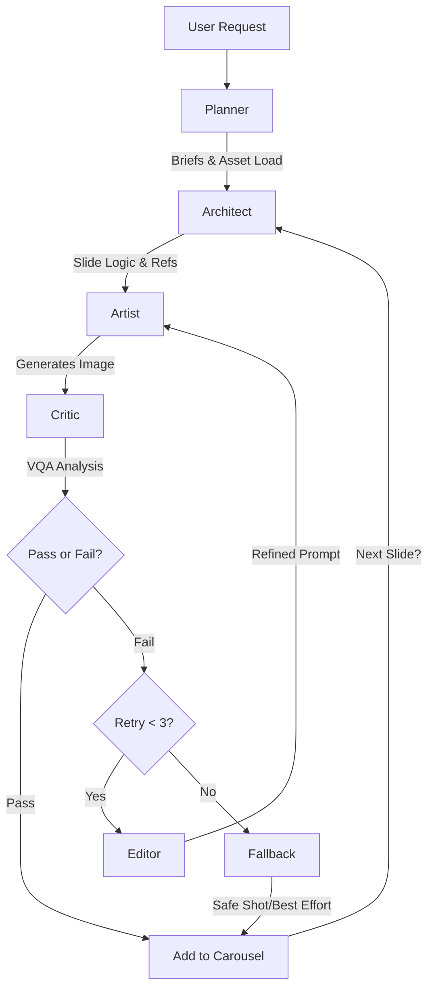

This consolidates the architectural sophistication of the **Cyclic Refinement Swarm** (File 1) with the strict operational constraints and domain specificity of the **Potero Carousel Factory** (File 2).

This version optimizes for the "Reasoning-First" capabilities of Gemini 3 Pro while maintaining the ruthlessly specific OPSEC and aesthetic guidelines of Potero.

---

# AGENTS.md — Potero Carousel Factory (Cyclic Swarm Edition)

**Version:** 2.0 (Gemini 3 Pro Swarm)
**Status:** Production
**Architecture:** Cyclic Refinement Graph

## 1. System Philosophy

This system generates 5-slide, 4:5 vertical image carousels for Potero using a **Multi-Agent Cyclic Graph** (Swarm Pattern). Unlike linear pipelines that propagate errors, this architecture uses an adversarial critique loop ("The Critic") to reject and refine outputs *before* they are accepted into the carousel.

### Core Principles

1. **Adversarial Quality Assurance:** The system assumes the generator will hallucinate (e.g., faces, text, wrong kit). The **Critic Agent** exists solely to reject these errors.
2. **Context Anchoring:** Slide 1 serves as the "Anchor." Slides 2–5 inject Slide 1 into their context window to enforce "same shoot day" consistency.
3. **OPSEC & Brand Integrity:**
* **No Faces:** Anonymity is absolute.
* **No In-Image Text:** Captions are post-production only, except the approved "POTERO STANDARD" embroidery that must exactly match the hoodie reference (size, color, placement) when the hoodie front is visible. Back shots may omit it.
* **Finnish Realism:** Only M05 patterns and real-world Finnish Reservist kit silhouettes.


4. **Reasoning-First Generation:** We leverage **Gemini 3 Pro's** reasoning capabilities to "plan" the composition (lighting, negative space) before rendering pixels.

---

## 2. Orchestration Workflow (State Machine)

The agents operate within a LangGraph state machine.



---

## 3. Agent Personas

### Agent A: The Planner (Strategy & Assets)

* **Role:** Pre-production logic. Converts a theme into a concrete execution plan.
* **Model:** `gemini-1.5-pro` (Text)
* **Responsibilities:**
* **Theme Parsing:** Converts `theme_id` (e.g., "winter_ambush") into 5 distinct `SlideBriefs`.
* **Asset Locking:** Selects one `design_id` (Hoodie) and locks it for the entire carousel.
* **Reference Loading:** Fetches the "Gold Standard" asset packs (M05 swatches, specific hoodie textures).


* **Output:** `CarouselState` object containing 5 initialized briefs.

### Agent B: The Artist (Generative Synthesis)

* **Role:** The "Hand." Executes the visual generation.
* **Model:** `gemini-3-pro-image-preview` (Nano Banana Pro)
* **System Instruction:**
> "You are a world-class photographer specializing in Finnish military realism. You follow the Slide Brief exactly. You use the provided Reference Images as strict ground truth. You do not hallucinate new details. **CRITICAL:** You never render text, logos, or faces. You prioritize grit, high ISO grain, and 'crushed blacks' aesthetics."
> "Exception: the only allowed text/logo is the approved hoodie embroidery that must match the reference images exactly."


* **Capabilities:**
* **Reasoning-Guided Synthesis:** Plans composition to ensure negative space exists for overlay text (without rendering the text itself).
* **Anchor Injection:** For Slides 2–5, ingests the image of Slide 1 to match lighting and color grading.


### Agent C: The Critic (Adversarial VQA)

* **Role:** The "Eye." Validates the output against strict Potero constraints.
* **Model:** `gemini-1.5-pro` (Vision Mode)
* **Methodology:** Visual Question Answering (VQA).
* **Checklist (The "Kill List"):**
1. **OPSEC Breach:** "Is a face or identifiable tattoo visible?" (If Yes -> **HARD FAIL**)
2. **Brand Violation:** "Is there readable text, a logo, or a flag?" (If Yes -> **HARD FAIL**)
   - Exception: the approved "POTERO STANDARD" embroidery is allowed only if it matches the hoodie reference exactly when the front is visible. Back shots may omit it.
3. **Anatomy:** "Zoom in on hands. Are there exactly 5 fingers? Are they holding the gear correctly?"
4. **Kit Accuracy:** "Is the camo pattern Finnish M05? If it looks like generic US Woodland, reject."
5. **Aesthetics:** "Is the lighting flat or glossy? We need harsh shadows and flash photography. If it looks like Midjourney artstation style, reject."


* **Output:** `QAResult` (Pass/Fail, Reason, Severity).

### Agent D: The Editor (Refinement & Recovery)

* **Role:** The "Fixer." Activated only upon Critic rejection.
* **Model:** `gemini-2.5-flash` (Logic/Speed optimized)
* **Workflow:**
1. Analyzes the Critic's failure reason (e.g., "Lighting is too flat").
2. Modifies the prompt *specifically* to address the flaw without changing the composition (e.g., appends "harsh camera flash, high contrast, underexposed").
3. Requests a seed change if the anatomy is broken.


---

## 4. Data Structures & State

### Shared State Object

```json
{
  "carousel_id": "run_2026_01_12_alpha",
  "global_constraints": {
    "design_id_locked": "hoodie_013_ranger_green",
    "environment": "pine_forest_fog",
    "aspect_ratio": "4:5"
  },
  "slides": [
    {
      "index": 1,
      "status": "completed",
      "image_path": "out/slide1.png",
      "qa_score": 98
    },
    {
      "index": 2,
      "status": "in_progress",
      "retry_count": 1,
      "last_critic_feedback": "FAIL: Generic digital camo detected. Enforce M05."
    }
  ]
}

```

### Slide Brief (Input to Artist)

```json
{
  "shot_type": "close_up_texture",
  "positive_prompt": "Macro shot of hoodie fabric, water droplets beading, pine needle foreground...",
  "negative_prompt": "text, watermark, face, eyes, illustration, cartoon, bright sunlight",
  "reference_assets": [
    "path/to/m05_swatch.png",
    "path/to/hoodie_013_macro.png",
    "path/to/slide_1_anchor.png" 
  ],
  "composition_guidance": "Leave top-left quadrant empty (negative space) for post-production typography."
}

```

---

## 5. Resilience & Fallback Hierarchy

To ensure production reliability, the system employs a "Graceful Degradation" strategy.

### Model Fallback

If `gemini-3-pro-image-preview` hits a 503 or Rate Limit:

1. **Primary:** `gemini-3-pro-image-preview` (Best reasoning/fidelity).
2. **Secondary:** `imagen-3.0-generate-001` (High throughput, reliable, strictly guided).
3. **Tertiary:** `gemini-1.5-flash` (Lowest fidelity—use only for "far away" silhouettes).

### Content Fallback (The "Safe Shot")

If **Agent D (Editor)** fails to fix an image after 3 attempts:

* The system abandons the complex prompt (e.g., "Soldier adjusting comtacs").
* It triggers a **Fallback Brief**: A simple, low-risk "texture/mood" shot (e.g., "Discarded gear on forest floor, foggy, static").
* This ensures the carousel always completes with 5 valid images.

---

## 6. Prompt Invariants (Immutable Blocks)

**Global Style Block (Prepended to ALL prompts):**

> "Photorealistic raw photo, Finnish Reservist aesthetic, M05 camouflage on gear only, grainy, high ISO, crushed blacks, desaturated greens/blues. Shot on 35mm film, harsh on-camera flash. Documentary style, not cinematic. POV: First-person or candid."

**Negative Constraints (Appended to ALL prompts):**

> "bad anatomy, extra fingers, watermark, signature, username, unapproved text, unapproved logo, flag, patch, name tape, face, eyes, skin, bright colors, sunny, studio lighting, bokeh, 3d render, cgi."
> "Only allowed text/logo is the approved 'POTERO STANDARD' embroidery that matches hoodie references exactly."

---

## 7. Implementation Roadmap

1. **Day 1 (Assets):** Populate Vector DB/Ref Folder with "Gold" assets (M05 swatches, clean hoodie product shots).
2. **Day 2 (Logic):** Implement the `Planner` and `Architect` to handle the `CarouselState`.
3. **Day 3 (The Swarm):** Connect `Artist` -> `Critic` -> `Editor` loop. Tune the `Critic`'s rejection threshold to be aggressive on faces/text.
4. **Day 4 (Integration):** Implement the "Anchor Image" injection (passing Slide 1 output as input to Slide 2).
5. **Day 5 (Stress Test):** Run adversarial tests (e.g., ask for "crowd scenes") to ensure the Critic catches OPSEC violations.

---

## 8. Production Readiness Review (Critical)

The current repo is a strong prototype but not production grade yet. Key gaps:

1. **Execution is stubbed:** The agents do not call real model APIs; they simulate results. Production requires actual API calls and error handling.
2. **State flow is incomplete:** Slide progression, retry limits, and fallback behavior need consistent state updates and termination rules.
3. **No dependency pinning:** There is no `pyproject.toml` or `requirements.txt`, which blocks reproducible builds and deployments.
4. **No test suite or CI:** There are no unit or integration tests validating planner output, critic rules, or the graph loop.
5. **No config contract:** Env vars and runtime config are not documented (no `.env.example`).
6. **No asset validation:** Reference assets are not loaded or verified; missing assets are not detected early.
7. **No observability:** Only print statements exist; no structured logging, metrics, or run artifacts.
8. **No persistence:** Outputs are not tracked in a database or object store, and there is no run registry.

---

## 9. Required Inputs and Reference Locations

Place all "Gold" reference assets under `assets/references/` and keep a stable naming scheme. Suggested layout:

```
assets/references/
  manifest.json
  m05/
    m05_swatch.png
  hoodies/
    hoodie_013_ranger_green_front.png
    hoodie_013_ranger_green_macro.png
```

Update `assets/references/manifest.json` to register assets and `src/agents/planner.py` (or a central config module) to inject these exact paths into each `SlideBrief.reference_assets`.

When `POTERO_REQUIRE_ASSETS=true`, the manifest must include:

- At least one `m05_swatches` entry
- At least one asset for the selected `design_id`

Required env vars (names only):

- `GOOGLE_API_KEY`
- `POTERO_THEME_ID`
- `POTERO_DESIGN_ID`
- `POTERO_PLANNER_MODE` (`template` | `template+llm`)
- `POTERO_CRITIC_MODEL` (default `models/gemini-2.5-flash`)
- `POTERO_CRITIC_WARN_THRESHOLD` (default `85`)
- `POTERO_CRITIC_FAIL_THRESHOLD` (default `70`)
- `POTERO_PLANNER_MODEL` (default `models/gemini-2.5-flash`)
- `POTERO_ARTIST_MODEL` (default `models/gemini-2.5-flash-image`)
- `POTERO_ARTIST_FALLBACKS` (comma-separated models, defaults to image preview)
- `POTERO_MAX_TOTAL_CALLS`
- `POTERO_MAX_PLANNER_CALLS`
- `POTERO_MAX_ARTIST_CALLS`
- `POTERO_MAX_CRITIC_CALLS`
- `POTERO_MAX_RETRIES_PER_SLIDE`

Budget limits are enforced per run; exceeding them stops generation.

Reference uploads are cached per run to avoid re-uploading the same files.

Critic outputs now include `violations` for hard-fail conditions (face/text/logo/etc).

You can also pass runtime inputs via CLI:

```
python -m src.main --theme winter_ambush --design hoodie_013_ranger_green
```

Outputs are written to `output/` by the Artist; keep this directory writable in production.

Run artifacts are stored per run under `output/<run_id>/`:

- `output/<run_id>/state.json`
- `output/<run_id>/briefs.json`

Testing and CI:

- Local tests: `python -m unittest discover -s tests`
- Smoke check: `POTERO_REQUIRE_API_KEY=false POTERO_REQUIRE_ASSETS=false python scripts/smoke_check.py`
- CI hook: `sh scripts/ci.sh` (used by `.github/workflows/ci.yml`)
- Install deps: `pip install -r requirements.txt`
- List available models: `python scripts/list_models.py`
