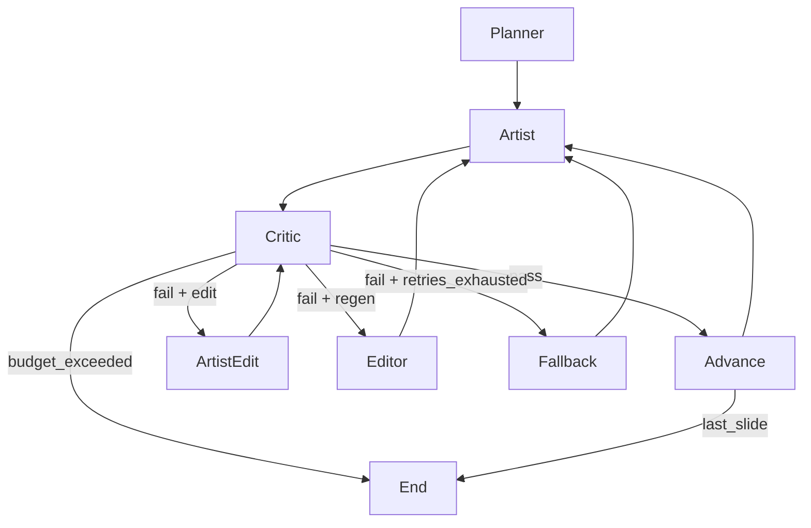

# Potero Autocontent AI Agent Strategy

This document describes the implemented AI agent strategy and runtime flow in this repository. It is based on the current code in `src/` and the orchestration defined in `src/graph.py`.

## Scope and goals
- Produce a 5-slide, 4:5 vertical image carousel for a given theme and design.
- Enforce strict OPSEC/brand constraints via a critic loop before accepting a slide.
- Support deterministic resumption, budgets, and fallback content on repeated failures.

## Entry point and run setup
- **CLI/Config**: `src/main.py` loads environment configuration (`src/config.py`) and optional CLI overrides (`--theme`, `--design`).
- **API key enforcement**: If `POTERO_REQUIRE_API_KEY=true` and `GOOGLE_API_KEY` is missing, the run exits early.
- **Asset registry validation**: `AssetRegistry.load()` reads `assets/references/manifest.json` and verifies referenced files. If `POTERO_REQUIRE_ASSETS=true`, missing required assets stop the run.
- **Run storage**: `RunStorage.create()` initializes `output/<run_id>/state.json` and `output/<run_id>/briefs.json` for persistence.
- **Budget**: `RunBudget` is instantiated from env limits. If resuming, budgets must match the stored run or the run aborts.
- **Resume logic**: If state exists, `current_slide_index` is set to the first incomplete slide; completed runs exit early.
- **Brief generation**: If no briefs exist, `Planner.generate_briefs()` creates them and persists state/briefs.
- **Graph execution**: The orchestration graph is compiled and invoked with `recursion_limit=50`.

## Data model and state
Defined in `src/state.py`:
- **CarouselState**: `carousel_id`, `global_constraints`, `slides`, `current_slide_index`, `budget`, `style_tighten_next`.
- **Indexing**: `SlideState.index` is 1-based, while `current_slide_index` is a 0-based array index.
- **GlobalConstraints**: `design_id_locked`, `environment`, `aspect_ratio`, `potero_shader_version`, `image_aspect`, `image_size`, `allow_warn_pass`, `potero_pass_threshold`, `potero_warn_threshold`, `enable_edit_mode`, `max_refs_per_call`, `max_refs_hard`, `anchor_candidates`.
- **SlideState**: status (`pending`, `in_progress`, `completed`, `failed`, `fallback_pending`), `image_path`, `qa_score`, `qa_status`, `retry_count`, `last_critic_feedback`, `opsec_pass`, `potero_score`, `potero_breakdown`, `repair_mode`, `repair_targets`, `repair_instructions`.
- **SlideBrief**: `index`, `shot_type`, `positive_prompt`, `negative_prompt`, `reference_assets`, `composition_guidance`, plus metadata (`intent`, `continuum_cue`, `kit_anchors`, `env_preset`, `lighting_signature`, `risk_profile`, `reference_roles_required`, `image_aspect`, `image_size`).

## Agent roles and behavior
### Planner (`src/agents/planner.py`)
- **Purpose**: Build a 5-slide plan and prompt briefs.
- **Modes**:
  - `template`: use fixed templates per theme.
  - `template+llm`: refine prompts via LLM, constrained to preserve indices and shot types.
- **Prompt compilation**: Uses `src/prompt_compiler.py` to inject locked Potero shader/negative blocks.
- **Metadata**: Infers intent, env preset, lighting signature, risk profile, kit anchors, and role requirements.
- **Reference roles**: Populates `reference_roles_required` for deterministic role-based selection.
- **Theme templates**:
  - `THEME_TEMPLATES` for specific themes (e.g., `winter_ambush`).
  - Fallback to `self._default_template(theme)` when no theme template exists.

### Artist (`src/agents/artist.py`)
- **Purpose**: Generate images from the brief and references.
- **Model fallback**: Primary model plus configured fallbacks (defaults: `imagen-3.0-generate-001`, `gemini-1.5-flash`).
- **Prompt construction**: Combines positive prompt, negative prompt, composition guidance, and a strict reference adherence instruction.
- **Anchor injection**: For slides 2-5, the image of slide 1 (anchor) is attached as context.
- **Candidate pool**: Slide 1 can generate multiple candidates and select the best by critic score (budget gated).
- **Outputs**: Writes `slide_<index>.png` in the run directory.

### Critic (`src/agents/critic.py`)
- **Purpose**: VQA-based validation of outputs against OPSEC and brand rules.
- **Checklist**: Face/tattoo visibility, unapproved text/logos, finger count, M05 accuracy, hoodie camo misuse, hoodie front/back consistency, embroidery accuracy, lighting style.
- **Output**: Strict JSON with `opsec_pass`, `potero_score`, `potero_breakdown`, `qa_score`, `repair_mode`, and `violations`.
- **Fail-fast**: Certain violations force `pass=false` and low `qa_score`.
- **Grading**: `qa_status` is `pass`, `warn`, or `fail` based on thresholds.
- **Fatal errors**: When the model is unavailable, critic returns `fatal=true` and the graph terminates the run.

### Editor (`src/agents/editor.py`)
- **Purpose**: Refine prompts after critic failure.
- **Modes**:
  - `rules`: apply deterministic constraints derived from critic feedback.
  - `llm`: use an LLM to rewrite the prompt, still constrained by rules and references.
- **Style tighten**: Applies a deterministic Potero tightening delta when OPSEC passes but Potero score is low.
- **Constraints**: Reasserts no unapproved text/logos, enforces embroidery and back design rules, and removes patch/gear text on demand.

## Orchestration graph (LangGraph)
Defined in `src/graph.py` as a cyclic refinement graph.

### Node details
- **Planner node**: Generates briefs if missing and persists them.
- **Artist node**:
  - Injects anchor context for slides > 1.
  - Runs kit consistency and brand drift preflight before generation.
  - Selects role-based reference packs with quality scoring + golden packs.
  - Consumes budget for artist calls; if exceeded, marks slide failed and skips critic.
  - Slide 1 can generate a candidate pool (budget gated) and pick the best by critic score.
  - Skips generation if a completed slide already has a file on disk.
  - On generation failure, increments retry count and stores feedback.
- **Critic node**:
  - If `skip_validation` is set, bypasses critic and returns failure or success based on slide state.
  - Consumes critic budget; if exceeded, marks slide failed.
  - Runs critic validation, optionally runs crop-critic checks (budget gated), updates Potero/OPSEC fields.
- **Editor node**: Refines the brief, optionally consuming editor budget.
- **ArtistEdit node**: Applies localized edit instructions and returns to critic.
- **Advance node**: Moves to the next slide and resets critic/retry flags.
- **Fallback node**: Replaces the brief with a Potero-safe template and sets `fallback_pending`.

### Routing logic
- **Pass**: If critic passes and this is not the final slide, advance; otherwise end.
- **Fail + retries remaining**: Route to artist edit if `repair_mode=edit` and edit mode is enabled; otherwise editor -> artist.
- **Fail + retries exhausted**: Route to fallback, then back to artist.
- **Budget exceeded**: Terminate immediately.

## Budgeting and limits
- Budgets are enforced via `src/budget.py` using `can_consume` and `consume`.
- Exceeding any limit marks the run as exceeded and halts further processing.
- Retry count is tracked per slide; retries beyond `max_retries_per_slide` trigger fallback.
- Anchor candidate scoring and crop-critic checks are budget gated to prevent runaway cost.

## Asset handling and reference caching
- `AssetRegistry` enforces a role/tag manifest for reference assets.
- Role-based selection injects golden packs and prefers higher-quality refs.
- References are attached to briefs and passed into artist/critic/editor as needed.
- `UploadCache` avoids re-uploading identical files using file hash + role.

## Persistence and logging
- **Artifacts**:
  - `output/<run_id>/state.json`
  - `output/<run_id>/briefs.json`
  - `output/<run_id>/slide_<index>.png`
- **Logging**: JSON-formatted logs include run id, level, message, and structured extras.

## Notes for evaluation
- The system is implemented as a cyclic refinement loop with explicit stop conditions (pass, budget, retries).
- Each agent is independent and stateless aside from the shared `GraphState` and persisted `CarouselState`.
- Reference assets and prompt invariants are enforced at the planner stage and reasserted by editor rules.
- Warn-pass results schedule a style-tighten injection on the next slide.
